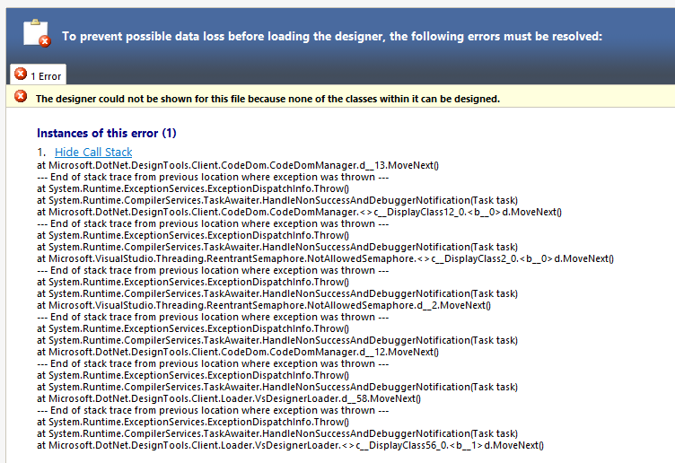

# Generic forms with WinForms designer for .NET8

This repository shows how to use generic controls with WinForms designer. The designer does not support generics out of the box, so a lot of workarounds are necessary. 

I mainly focus on .NET 8, but most of the workarounds are also necessary for .NET Framework projects.

At the time of writing this, the current Visual Studio 2022 version is 17.11, but the designer behavior might change in the future.

## Simple sample: generic form

The sample [GenericForm](/GenericForm) consists of a simple form with a generic declaration:

~~~~c#
  public partial class FormGeneric<TClass> : Form
    where TClass : BaseClass
  {
~~~~

When opening this form in designer, this error is reported:

~~~~
The designer could not be shown for this file because none of the classes within it can be designed. 

  at Microsoft.DotNet.DesignTools.Client.CodeDom.CodeDomManager.d__13.MoveNext()
  --- End of stack trace from previous location where exception was thrown ---
  at System.Runtime.ExceptionServices.ExceptionDispatchInfo.Throw()
  at System.Runtime.CompilerServices.TaskAwaiter.HandleNonSuccessAndDebuggerNotification(Task task)
  at Microsoft.DotNet.DesignTools.Client.CodeDom.CodeDomManager.<>c__DisplayClass12_0.<b__0>d.MoveNext()
  --- End of stack trace from previous location where exception was thrown ---
  at System.Runtime.ExceptionServices.ExceptionDispatchInfo.Throw()
  at System.Runtime.CompilerServices.TaskAwaiter.HandleNonSuccessAndDebuggerNotification(Task task)
  at Microsoft.VisualStudio.Threading.ReentrantSemaphore.NotAllowedSemaphore.<>c__DisplayClass2_0.<b__0>d.MoveNext()
  --- End of stack trace from previous location where exception was thrown ---
  at System.Runtime.ExceptionServices.ExceptionDispatchInfo.Throw()
  at System.Runtime.CompilerServices.TaskAwaiter.HandleNonSuccessAndDebuggerNotification(Task task)
  at Microsoft.VisualStudio.Threading.ReentrantSemaphore.NotAllowedSemaphore.d__2.MoveNext()
  --- End of stack trace from previous location where exception was thrown ---
  at System.Runtime.ExceptionServices.ExceptionDispatchInfo.Throw()
  at System.Runtime.CompilerServices.TaskAwaiter.HandleNonSuccessAndDebuggerNotification(Task task)
  at Microsoft.DotNet.DesignTools.Client.CodeDom.CodeDomManager.d__12.MoveNext()
  --- End of stack trace from previous location where exception was thrown ---
  at System.Runtime.ExceptionServices.ExceptionDispatchInfo.Throw()
  at System.Runtime.CompilerServices.TaskAwaiter.HandleNonSuccessAndDebuggerNotification(Task task)
  at Microsoft.DotNet.DesignTools.Client.Loader.VsDesignerLoader.d__58.MoveNext()
  --- End of stack trace from previous location where exception was thrown ---
  at System.Runtime.ExceptionServices.ExceptionDispatchInfo.Throw()
  at System.Runtime.CompilerServices.TaskAwaiter.HandleNonSuccessAndDebuggerNotification(Task task)
  at Microsoft.DotNet.DesignTools.Client.Loader.VsDesignerLoader.<>c__DisplayClass56_0.<b__1>d.MoveNext()  

~~~~

To open the "FormGeneric" in my sample, two steps are necessary:

* Step 1: In the main form file, replace this:

  ~~~~c#
    public partial class FormGeneric<TClass> : Form
      where TClass : BaseClass
  ~~~~

  with this:

  ~~~~c#
    public partial class FormGeneric : Form
  ~~~~

* Step 2: In the ".Designer.cs" file, replace

  ~~~~c#
    partial class FormGeneric<TClass>
  ~~~~

  with this:

  ~~~~c#
    partial class FormGeneric
  ~~~~

Of course, my sample project will not compile after this change, because I use the generic parameter in some code. Ignore the compilation error and open the form in designer - it should work.

## Simple sample: generic form with "resx.file"
This sample [GenericFormWithResx](/GenericFormWithResx) adds a PictureBox to the form, which displays an image from a local resource file. 
This file is written to "FormGeneric.resx".

After having removed the generics workarouns from the previous sample, the "InitializeComponent" code will not compile because of this line:

~~~~c#
      System.ComponentModel.ComponentResourceManager resources = new System.ComponentModel.ComponentResourceManager(typeof(FormGeneric));
~~~~

So, add the generics declaration here, too:
~~~~c#
      System.ComponentModel.ComponentResourceManager resources = new System.ComponentModel.ComponentResourceManager(typeof(FormGeneric<TClass>));
~~~~

When launching the sample, there will be an exception:

~~~~c#
System.Resources.MissingManifestResourceException
  HResult=0x80131532
  Message=Could not find the resource "GenericFormWithResx.FormGeneric`1.resources" among the resources "GenericFormWithResx.FormGeneric.resources", "GenericFormWithResx.Properties.Resources.resources" embedded in the assembly "GenericFormWithResx", nor among the resources in any satellite assemblies for the specified culture. Perhaps the resources were embedded with an incorrect name.
  Source=System.Private.CoreLib
  StackTrace:
   at System.Resources.ManifestBasedResourceGroveler.HandleResourceStreamMissing(String fileName)
   at System.Resources.ManifestBasedResourceGroveler.GrovelForResourceSet(CultureInfo culture, Dictionary`2 localResourceSets, Boolean tryParents, Boolean createIfNotExists)
   at System.Resources.ResourceManager.InternalGetResourceSet(CultureInfo culture, Boolean createIfNotExists, Boolean tryParents)
   at System.Resources.ResourceManager.GetObject(String name, CultureInfo culture, Boolean wrapUnmanagedMemStream)
   at GenericFormWithResx.FormGeneric`1.InitializeComponent() in E:\Projekte\Temp\GenericFormWithResx\FormGeneric.Designer.cs:line 58
   at GenericFormWithResx.FormGeneric`1..ctor() in E:\Projekte\Temp\GenericFormWithResx\FormGeneric.cs:line 9
   at GenericFormWithResx.Program.Main() in E:\Projekte\Temp\GenericFormWithResx\Program.cs:line 15
~~~~

As you can see, .NET tries to load a file "FormGeneric\`1.resources", while the designer resx file is compiled to "FormGeneric.resources".
The backtick char followed by a number stands for "generic class with n type arguments". If the class had three type parameters, .NET would look for "FormGeneric\`3.resources".

So, duplicate the file "FormGeneric.resx" and name it "FormGeneric\`1.resx". The result should look like this:

Whenever you make changes to "FormGeneric.resx", you will have to copy the content of this file to "FormGeneric\`1.resx".

To sum it up: In order to open this form in designer, we need three changes:

* Step 1: In the main form file, replace this:

  ~~~~c#
    public partial class FormGeneric<TClass> : Form
      where TClass : BaseClass
  ~~~~

  with this:

  ~~~~c#
    public partial class FormGeneric : Form
  ~~~~

* Step 2: In the ".Designer.cs" file, replace

  ~~~~c#
    partial class FormGeneric<TClass>
  ~~~~

  with this:

  ~~~~c#
    partial class FormGeneric
  ~~~~

* Step 3: In "InitializeComponent" of the ".Designer.cs" file, replace

  ~~~~c#
        System.ComponentModel.ComponentResourceManager resources = new System.ComponentModel.ComponentResourceManager(typeof(FormGeneric<TClass>));
  ~~~~

  with this:
  ~~~~c#
        System.ComponentModel.ComponentResourceManager resources = new System.ComponentModel.ComponentResourceManager(typeof(FormGeneric));
  ~~~~

When opening the designer, another error will be reported:

~~~~
Value cannot be null. (Parameter 'baseName')    
 
  at StreamJsonRpc.JsonRpc.d__154`1.MoveNext()
  --- End of stack trace from previous location where exception was thrown ---
  at System.Runtime.ExceptionServices.ExceptionDispatchInfo.Throw()
  at System.Runtime.CompilerServices.TaskAwaiter.HandleNonSuccessAndDebuggerNotification(Task task)
  at Microsoft.DotNet.DesignTools.Client.Host.ServerHost.d__16.MoveNext()
  --- End of stack trace from previous location where exception was thrown ---
  at System.Runtime.ExceptionServices.ExceptionDispatchInfo.Throw()
  at System.Runtime.CompilerServices.TaskAwaiter.HandleNonSuccessAndDebuggerNotification(Task task)
  at Microsoft.DotNet.DesignTools.Client.DesignToolsClientLoader.d__29.MoveNext()
  --- End of stack trace from previous location where exception was thrown ---
  at System.Runtime.ExceptionServices.ExceptionDispatchInfo.Throw()
  at System.Runtime.CompilerServices.TaskAwaiter.HandleNonSuccessAndDebuggerNotification(Task task)
  at Microsoft.DotNet.DesignTools.Client.DesignToolsClientLoader.<>c__DisplayClass25_1.<<-ctor>b__1>d.MoveNext()
  --- End of stack trace from previous location where exception was thrown ---
  at System.Runtime.ExceptionServices.ExceptionDispatchInfo.Throw()
  at System.Runtime.CompilerServices.TaskAwaiter.HandleNonSuccessAndDebuggerNotification(Task task)
  at Microsoft.DotNet.DesignTools.Client.DesignToolsClientLoader.d__27.MoveNext()  

~~~~

Note: I first observed this error after migrating to .NET6, so it might not happen in .NET Framework projects.

There is a workaround:
* Step 1: rename the file "FormGeneric\`1.resx" so that the filename does not contain any backtick.
You will have to repeat this for all files with a backtick in the file name in the current project.
* Step 2: if you have seen the error, you must close Visual Studio and reopen it. Otherwise, the same error will be shown even after 
applying the workaround. If you applied the workaround before the error was reported, you can open the designer safely.

Of course, you have to rename the resx files again to the backtick version before launching your application, otherwise resources will not be found.

## Inheritance from generic form
The next sample [GenericFormSubclass](/GenericFormSubclass) adds a subclass to the generic form.
The base class is in a class library project "GenericFormLib", the sub class in "GenericFormApp". I did this to concentrate on the subclass problem - 
further problems might arise if the generic base class and the sub class are inside the same project.

When opening the child class "FormChild" in designer, this error is shown:

~~~~
Cannot create an instance of GenericFormLib.FormGeneric`1[TClass] because Type.ContainsGenericParameters is true. 

  at System.Reflection.RuntimeConstructorInfo.CheckCanCreateInstance(Type declaringType, Boolean isVarArg)
  at System.Reflection.RuntimeConstructorInfo.ThrowNoInvokeException()
  at System.Reflection.RuntimeConstructorInfo.Invoke(BindingFlags invokeAttr, Binder binder, Object[] parameters, CultureInfo culture)
  at System.Reflection.ConstructorInfo.Invoke(Object[] parameters)
  at System.ComponentModel.ReflectTypeDescriptionProvider.CreateInstance(IServiceProvider provider, Type objectType, Type[] argTypes, Object[] args)
  at System.ComponentModel.TypeDescriptor.CreateInstance(IServiceProvider provider, Type objectType, Type[] argTypes, Object[] args)
  at Microsoft.DotNet.DesignTools.Host.RemoteDesignerHost.CreateInstance(Type type)
  at Microsoft.DotNet.DesignTools.Host.RemoteDesignerHost.CreateComponent(Type componentClass, String name)
  at Microsoft.DotNet.DesignTools.Serialization.DesignerSerializationManager.CreateInstance(Type type, ICollection arguments, String name, Boolean addToContainer)
  at Microsoft.DotNet.DesignTools.Serialization.DesignerSerializationManager.System.ComponentModel.Design.Serialization.IDesignerSerializationManager.CreateInstance(Type type, ICollection arguments, String name, Boolean addToContainer)
  at Microsoft.DotNet.DesignTools.Serialization.TypeCodeDomSerializer.Deserialize(IDesignerSerializationManager manager, CodeTypeDeclaration declaration)
  at Microsoft.DotNet.DesignTools.Sessions.Session.DeserializeToRootComponent(CodeTypeDeclaration typeDeclaration, String rootComponentClassName)
  at Microsoft.DotNet.DesignTools.Sessions.Session.DeserializeRootComponent(CodeTypeDeclaration typeDeclaration, String rootComponentClassName, ResourceContentData[] resourceDocDataContent, String basePath)
  at Microsoft.DotNet.DesignTools.Protocol.Endpoints.Sessions.InitializeRootComponentHandler.HandleRequest(InitializeRootComponentRequest request)
  at Microsoft.DotNet.DesignTools.Protocol.Endpoints.RequestHandler`2.Microsoft.DotNet.DesignTools.Protocol.Endpoints.IRequestHandler.HandleRequest(Request request) 

~~~~

Explanation: the designer tries to create the base class and cannot do so because it cannot infer the generic type parameters.

Workaround: we break the inheritance hierarchy and introduce a base class which resides between "FormChild" and "FormGeneric<TClass>":

~~~~c#
  public class FormGenericWrapper : FormGeneric<ChildClass>
  {

  }
~~~~

Now, we can let "FormChild" inherit from this base class:

~~~~c#
  public partial class FormChild : FormGenericWrapper
  {
~~~~

Some time ago, it worked to place this wrapper class inside the main form file, but some Visual Studio 2022 version changed this, now this error is reported:

~~~~
The class FormGenericWrapper can be designed, but is not the first class in the file. 
Visual Studio requires that designers use the first class in the file. 
Move the class code so that it is the first class in the file and try loading the designer again. 

  at Microsoft.DotNet.DesignTools.Client.CodeDom.CodeDomManager.d__13.MoveNext()
  --- End of stack trace from previous location where exception was thrown ---
  at System.Runtime.ExceptionServices.ExceptionDispatchInfo.Throw()
  at System.Runtime.CompilerServices.TaskAwaiter.HandleNonSuccessAndDebuggerNotification(Task task)
  at Microsoft.DotNet.DesignTools.Client.CodeDom.CodeDomManager.<>c__DisplayClass12_0.<b__0>d.MoveNext()
  --- End of stack trace from previous location where exception was thrown ---
  at System.Runtime.ExceptionServices.ExceptionDispatchInfo.Throw()
  at System.Runtime.CompilerServices.TaskAwaiter.HandleNonSuccessAndDebuggerNotification(Task task)
  at Microsoft.VisualStudio.Threading.ReentrantSemaphore.NotAllowedSemaphore.<>c__DisplayClass2_0.<b__0>d.MoveNext()
  --- End of stack trace from previous location where exception was thrown ---
  at System.Runtime.ExceptionServices.ExceptionDispatchInfo.Throw()
  at System.Runtime.CompilerServices.TaskAwaiter.HandleNonSuccessAndDebuggerNotification(Task task)
  at Microsoft.VisualStudio.Threading.ReentrantSemaphore.NotAllowedSemaphore.d__2.MoveNext()
  --- End of stack trace from previous location where exception was thrown ---
  at System.Runtime.ExceptionServices.ExceptionDispatchInfo.Throw()
  at System.Runtime.CompilerServices.TaskAwaiter.HandleNonSuccessAndDebuggerNotification(Task task)
  at Microsoft.DotNet.DesignTools.Client.CodeDom.CodeDomManager.d__12.MoveNext()
  --- End of stack trace from previous location where exception was thrown ---
  at System.Runtime.ExceptionServices.ExceptionDispatchInfo.Throw()
  at System.Runtime.CompilerServices.TaskAwaiter.HandleNonSuccessAndDebuggerNotification(Task task)
  at Microsoft.DotNet.DesignTools.Client.Loader.VsDesignerLoader.d__58.MoveNext()
  --- End of stack trace from previous location where exception was thrown ---
  at System.Runtime.ExceptionServices.ExceptionDispatchInfo.Throw()
  at System.Runtime.CompilerServices.TaskAwaiter.HandleNonSuccessAndDebuggerNotification(Task task)
  at Microsoft.DotNet.DesignTools.Client.Loader.VsDesignerLoader.<>c__DisplayClass56_0.<b__1>d.MoveNext() 
~~~~

So, add a new file to the project, containing only this wrapper:

After having designed your form, you could remove the wrapper again. Or you keep it - the workaround might be necessary again later.

## To be continued....

